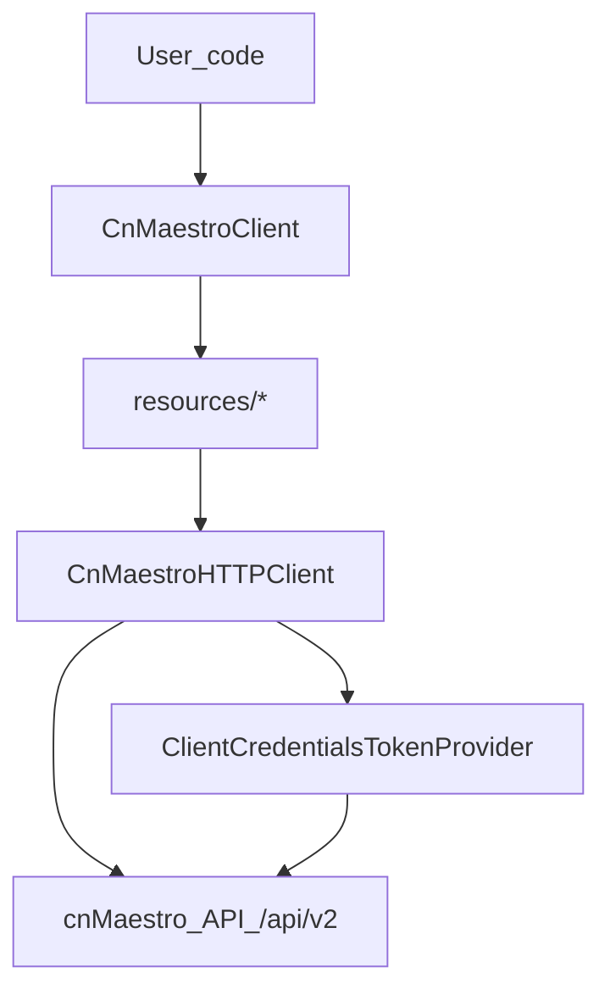

# 0001. Repository structure to date

Date: 2026-05-27
Status: Accepted

## Context

`python-cambium-cnmaestro` is a minimal Python SDK for Cambium cnMaestro.

The SDK scope is tracked as a REST endpoint checklist in
[`docs/endpoint-checklist.md`](../endpoint-checklist.md), cross-checked against the bundled OpenAPI spec.

The codebase is intentionally small and favors:

- Thin resource wrappers over the HTTP API (returning raw JSON).
- A single `httpx`-based HTTP client with retries and error mapping.
- A single OAuth2 client-credentials token provider.

## Decision

### Layout

- `cambium_cnmaestro/`
  - `client.py`: `CnMaestroClient` entry point; wires resources
  - `auth.py`: OAuth2 client-credentials token provider for `POST /access/token`
  - `http.py`: `httpx` HTTP client; retries/rate-limit handling; error mapping
  - `errors.py`: exception types used across the SDK
  - `resources/`: grouped resource wrappers (Devices, Networks, Sites, WiFi Enterprise, cnMatrix)
- `docs/`
  - `endpoint-checklist.md`: authoritative SDK scope tracker
  - `adr/`: architecture decision records for this repository
- `tests/`: pytest tests (currently a smoke placeholder)

### SDK layering (data flow)

### Resource conventions

- Resources are **thin HTTP wrappers** around cnMaestro REST endpoints.
- Public resource methods use **keyword-only** parameters (`def method(self, *, ...)`).
- Methods generally return **raw decoded JSON** (`Any`) and do not introduce SDK-wide models.
- CRUD naming aligns to HTTP verbs: `list`, `get`, `create`, `update`, `delete`.

### “CRUD vs operations”

Repository policy is to keep REST endpoints implemented as direct wrappers.
If higher-level behavior is needed (e.g. lookup by alternate key, create-or-update),
it should be implemented as explicit “operations” methods layered on top of CRUD,
without changing existing CRUD semantics.

### Agent guidance + memory

To keep conventions and project context accessible to humans and tools:

- `AGENTS.md` at repo root contains instructions for automated agents.
- Agent-agnostic repository memory lives under `.agents/memory/`.
- `.cursor/` is present only as a shim pointing to `.agents/` (no canonical memory in `.cursor`).

## Consequences

- New endpoint work should follow the existing layering and add/extend resource modules under
  `cambium_cnmaestro/resources/`.
- `docs/endpoint-checklist.md` should remain the single place to track implemented endpoint coverage.
- Tests should be added using `pytest` and `pytest-httpx` (already present as dev dependencies).
- Repository conventions/memory should be updated under `.agents/memory/` (not `.cursor/memory/`).

